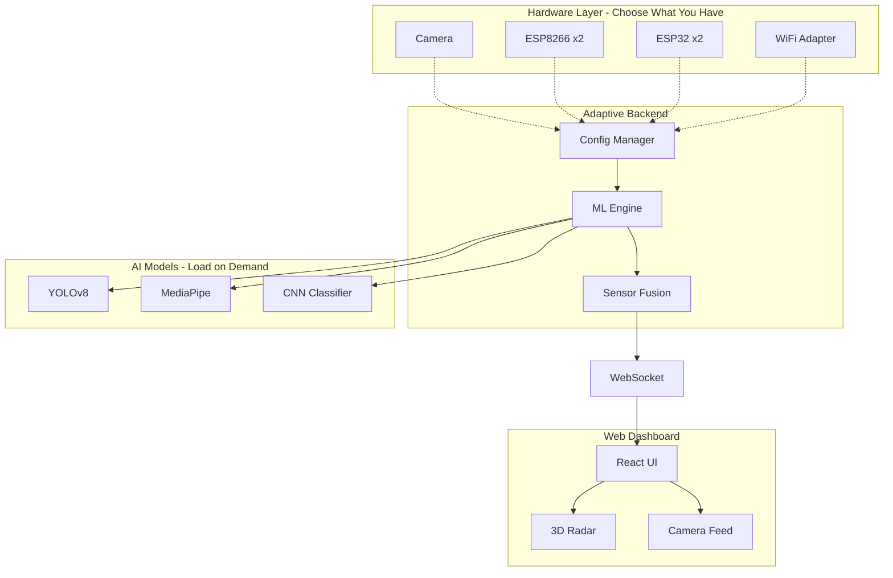

# Cerberus EchoSense
**Adaptive Multi-Modal AI-Powered Motion Detection System**

<div align="center">


*Advanced Detection System with Camera Vision, WiFi Sensing, and Intelligent Sensor Fusion*

</div>

---

## 🎯 Overview

Cerberus EchoSense is a **modular detection platform** that adapts to whatever hardware you have available. From simple webcam-based object detection to advanced WiFi CSI sensing, the system provides comprehensive motion tracking with intelligent handoff between sensors.

### Key Features

✨ **Flexible Hardware Support**
- 🎥 **Camera Only** - YOLO object detection + pose estimation
- 📡 **ESP8266** - Basic WiFi RSSI motion detection  
- 🔬 **ESP32** - Advanced CSI-based ML classification
- 📶 **WiFi Adapter** - Monitor mode packet capture
- 🎯 **Hybrid** - Camera + WiFi with intelligent handoff

🤖 **AI/ML Powered**
- YOLOv8 object detection (real-time)
- MediaPipe pose estimation (17 keypoints)
- LSTM-based CSI motion classifier
- Activity recognition (walking, standing, sitting, running)
- Multi-object tracking with persistent IDs

🌐 **Advanced Capabilities**
- **Intelligent Handoff**: Track objects from camera → WiFi when exiting frame
- **Through-Wall Detection**: WiFi sensing works through obstacles
- **24/7 Coverage**: Camera for precision, WiFi for continuous presence
- **Real-time WebSocket Streaming**: Live updates to browser dashboard

---

## 🚀 Quick Start

### Installation

```bash
# Clone repository
git clone https://github.com/your-username/cerberus-echosense
cd cerberus-echosense

# Run setup wizard (interactive)
python setup_wizard.py
```

The wizard will:
1. Detect available hardware (camera, WiFi adapters)
2. Prompt you to select mode (Camera/ESP8266/ESP32/WiFi/Hybrid)
3. Install required dependencies
4. Download ML models
5. Generate configuration file

### Running the System

```bash
# Terminal 1: Backend
cd backend
python server.py

# Terminal 2: Frontend
cd frontend
npm install  # First time only
npm run dev

# Open browser
# http://localhost:5173
```

---

## 📖 Hardware Modes Explained

| Mode | Hardware | Use Case | Setup Time |
|------|----------|----------|------------|
| **Camera Only** | USB Webcam | Indoor object detection, pose tracking | 5 min |
| **ESP8266 RSSI** | 2x ESP8266 | Through-wall motion, presence detection | 15 min |
| **ESP32 CSI** | 2x ESP32 | Research-grade WiFi sensing, ML classification | 30 min |
| **WiFi Adapter** | Monitor-capable adapter | No ESP needed, ambient WiFi analysis | 10 min |
| **Hybrid** | Camera + any WiFi | Complete coverage, handoff tracking | 20 min |

### Mode Selection Guide

**Choose Camera Only if:**
- You have a webcam but no ESP boards
- You need precise bounding boxes and pose estimation
- You only care about in-frame detection

**Choose ESP8266/ESP32 if:**
- You want through-wall/obstacle detection
- You need presence sensing without cameras
- Privacy is a concern (no video capture)

**Choose WiFi Adapter if:**
- You don't have ESP boards
- You have a monitor-capable WiFi adapter
- You're on Linux with root access

**Choose Hybrid if:**
- You want the best of both worlds
- You need seamless tracking as objects exit camera FOV
- You want 24/7 coverage (camera precision + WiFi continuity)

See **[HARDWARE_GUIDE.md](HARDWARE_GUIDE.md)** for detailed setup instructions!

---

## 🏗️ System Architecture



---

## 🎮 Features by Mode

### Camera Mode Features
- ✅ Real-time object detection (80+ classes)
- ✅ Person tracking with bounding boxes
- ✅ Pose estimation (17 skeletal keypoints)
- ✅ Activity recognition (walking, standing, sitting)
- ✅ Multi-person tracking with unique IDs
- ✅ Confidence scoring
- ❌ Through-wall detection
- ❌ Out-of-frame tracking

### WiFi Mode Features (ESP8266/ESP32/Adapter)
- ✅ Through-wall/obstacle motion detection
- ✅ Presence sensing (no visual data)
- ✅ Privacy-preserving (no camera)
- ✅ Works in darkness
- ✅ ML-based classification (ESP32)
- ❌ Precise localization
- ❌ Pose/appearance information

### Hybrid Mode Features (Camera + WiFi)
- ✅ **All camera features**
- ✅ **All WiFi features**
- ✅ **Intelligent handoff** when exiting camera FOV
- ✅ **Persistent tracking IDs** across modalities
- ✅ **24/7 coverage** (indoor + outdoor)
- ✅ **Best accuracy** with sensor fusion

---

## 🌊 Detection Flow (Hybrid Mode)

```
┌──────────────────────────────────────────────────────────────┐
│                     Person Enters Room                        │
└────────────────────────┬─────────────────────────────────────┘
                         │
              ┌──────────▼──────────┐
              │  Camera Detection   │ ← YOLO + Pose
              │  Source: CAMERA     │
              │  ID: #1             │
              └──────────┬──────────┘
                         │
              ┌──────────▼──────────┐
              │ Person exits frame  │
              └──────────┬──────────┘
                         │
              ┌──────────▼──────────┐
              │  Handoff Delay      │ ← 500ms configurable
              │  (500ms)            │
              └──────────┬──────────┘
                         │
              ┌──────────▼──────────┐
              │  WiFi Detection     │ ← CSI/RSSI variance
              │  Source: WIFI       │
              │  ID: #1 (same!)     │
              │  Out of Frame: ✓    │
              └──────────┬──────────┘
                         │
              ┌──────────▼──────────┐
              │ Person re-enters    │
              └──────────┬──────────┘
                         │
              ┌──────────▼──────────┐
              │  Camera Re-acquire  │ ← ID preserved
              │  Source: CAMERA     │
              │  ID: #1             │
              └─────────────────────┘
```

---

## 📊 Web Dashboard

The React-based dashboard provides:

### Main View
- **3D Radar Visualization** - Animated radar sweep with motion blips
- **Spectral Grid** - CSI subcarrier heatmap (ESP32 mode)
- **Pose Skeleton** - Real-time stick figure (Camera mode)
- **Detection Stats** - RSSI, variance, confidence metrics

### Camera Feed View (Camera/Hybrid modes)
- **Live Video Stream** - Real-time camera feed
- **Bounding Boxes** - Green (camera) / Orange (WiFi handoff)
- **Tracking IDs** - Persistent object identifiers
- **Pose Overlay** - Skeletal keypoints on detected persons

### Activity Timeline
- **Event History** - Timestamped detection events
- **Mode Indicators** - Camera/WiFi/Fusion source markers
- **Confidence Graphs** - Detection confidence over time

---

## ⚙️ Configuration

Edit `config.yaml` after running setup wizard:

```yaml
hardware:
  mode: "hybrid"  # auto, camera_only, esp8266, esp32, wifi_adapter, hybrid
  
  camera:
    enabled: true
    device: 0
    resolution: [640, 480]
    fps: 30
  
  esp32:
    enabled: true
    udp_port: 8889

detection:
  yolo:
    model: "yolov8n.pt"
    confidence: 0.5
    device: "cuda"  # cpu, cuda, mps
  
  csi:
    use_ml_classifier: true
    model_path: "models/csi_lstm.h5"

fusion:
  camera_priority: true
  handoff_delay_ms: 500
  tracking_timeout_s: 5
```

---

## 🧪 Advanced: Training Custom CSI Models

For ESP32 CSI mode, you can train custom activity classifiers:

```bash
# 1. Collect labeled data
python backend/collect_csi_data.py --label walking --duration 120
python backend/collect_csi_data.py --label sitting --duration 120
python backend/collect_csi_data.py --label standing --duration 120

# 2. Train LSTM model
python backend/train_csi_model.py \
    --data data/csi_samples/ \
    --epochs 50 \
    --batch-size 32

# 3. Model saved to backend/models/csi_lstm.h5
```

---

## 🔬 Technical Details

### Camera Vision Pipeline
- **YOLO**: YOLOv8n (nano) for real-time detection @ 30+ FPS
- **Pose**: MediaPipe Pose (BlazePose) - 17 keypoints
- **Tracking**: Centroid-based ID assignment with IoU matching

### WiFi Sensing Methods
- **RSSI (ESP8266)**: Variance analysis on rolling window
- **CSI (ESP32)**: 64 subcarrier amplitude/phase extraction
- **Monitor Mode**: Ambient packet RSSI analysis

### Sensor Fusion Algorithm
1. If camera detects → use camera (high confidence)
2. If camera loses object → start handoff timer
3. After delay → switch to WiFi if motion detected
4. WiFi continues tracking with "out of frame" flag
5. Camera re-acquires → resume camera tracking (same ID)

---

## 📁 Project Structure

```
cerberus-echosense/
├── backend/
│   ├── server.py           # Main FastAPI backend
│   ├── ml_engine.py        # Modular detection engine
│   ├── wifi_monitor.py     # WiFi adapter capture script
│   ├── models/             # ML model storage
│   └── requirements.txt
├── firmware/
│   ├── tx_main/            # ESP8266 transmitter
│   ├── rx_main/            # ESP8266 receiver
│   ├── esp32_csi_tx/       # ESP32 CSI transmitter
│   └── esp32_csi_rx/       # ESP32 CSI receiver
├── frontend/
│   ├── src/
│   │   ├── App.jsx
│   │   └── components/
│   │       ├── Radar.jsx
│   │       └── CameraView.jsx
│   └── package.json
├── config.yaml             # System configuration
├── setup_wizard.py         # Interactive setup
├── README.md
└── HARDWARE_GUIDE.md       # Detailed hardware setup
```

---

## 🤝 Contributing

Contributions welcome! Areas of interest:
- Additional ML models (pose classification, gesture recognition)
- Support for more hardware (ESP32-C3, Raspberry Pi Pico W)
- Frontend enhancements (charts, alerts, multi-camera)
- CSI processing improvements

---

## 📄 License

MIT License - see LICENSE file

---

## 🙏 Acknowledgments

- **YOLOv8** - Ultralytics
- **MediaPipe** - Google
- **ESP32-CSI-Tool** - Steven Hernandez
- **React Three Fiber** - Poimandres

---

## 📞 Support

- **Issues**: Open an issue on GitHub
- **Discussions**: Start a discussion for questions
- **Email**: sudeepawanigarathne09@gmail.com

---

**Built with ❤️ by Sudeepa Wanigarathna**

*Transforming commodity hardware into intelligent sensing systems*
